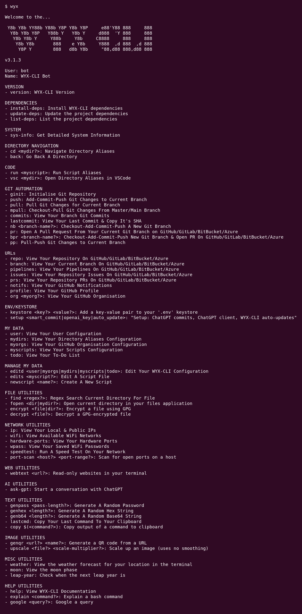

# ⚡️ WYX CLI ⚡️

Optimize your development productivity in the terminal

<hr>

[](https://hwixley.github.io/wyx-cli/) [](https://github.com/hwixley/WYX-CLI/actions/workflows/jekyll-gh-pages.yml) [](https://github.com/hwixley/WYX-CLI/actions/workflows/main.yml)<br>   

<hr>
<p align="center">

</p>

<hr>

## Table of Contents

- [⚡️ WYX CLI ⚡️](#️-wyx-cli-️)
  - [Table of Contents](#table-of-contents)
  - [What It Does](#what-it-does)
  - [Why It Was Made](#why-it-was-made)
  - [Support This Project](#support-this-project)
  - [Installation](#installation)
  - [Extra Feature Setup](#extra-feature-setup)
  - [Factory-reset Installation](#factory-reset-installation)
  - [Dependencies](#dependencies)
  - [List of Commands](#list-of-commands)

<hr>

## What It Does

Provides developers with the ability for optimising the execution of commonly performed tasks, commands, directory navigations, and environment setups/script executions.

## Why It Was Made

I found myself executing the same commands repeatedly, finding navigation on the terminal for frequently accessed locations needlessly slow, and the task of pushing out new code via manually submitting a PR on my browser repetitive and time-wasting. I decided to start developing my own bash scripting library to help alleviate these issues, and realized the whole world of opportunity I had to help optimize my own daily workflows on the terminal. Due to my experience working simultaneously on Mac and Linux machines one of the key parts of the WYX-CLI project was to also allow the same code to run in different shells and operating systems. 

<hr>

## Support This Project

If you have found this tool useful/insightful please leave a :star: on the repository it really helps me out!

I also have a [buymeacoffee](https://www.buymeacoffee.com/hwixley) sponsor link if you would like to help turn my caffeine addiction into a problem :coffee::zap:

<hr>

## Installation

1. Clone this repository into a folder of your choice:

```
git clone git@github.com:hwixley/WYX-CLI.git
```

2. Navigate into the directory:

```
cd WYX-CLI
```

3. Give permissions to the setup script and run it:

```
chmod +x setup.sh && ./setup.sh
```

4. Reopen your terminal or run `source ~/.bashrc` (`source ~/.zshrc` for unix systems)

Type `wyx` to see the list of commands and start developing some magic!

## Extra Feature Setup

1. You can use OpenAI's ChatGPT to write commit messages for you (using `git diff` and `git status` outputs) when using the `wyx push` command. <i>This requires an OpenAI API key.</i>

```
wyx setup smart_commit
```

## Factory-reset Installation

1. Remove your cloned repository

```
rm -rf <path-of-installation>
```

2. Remove the wyx-cli script setup in your environment file
   - Open the file in an editor: (`~/.bashrc` for linux systems, and `~/.zshrc` for unix systems)
     ```
     gedit ~/.bashrc
     ```
     If `gedit` is not available you can always use vim instead:
     ```
     vi ~/.bashrc
     ```
   - Remove the 2 lines for the wyx-cli:<br>
     - The first line is a comment: `# WYX-CLI`<br>
     - The second line is where the command is actually setup: `alias wyx="<path-of-installation>/wyx-cli.sh"`
2. Follow the [installation instructions](https://github.com/hwixley/wyx-cli#installation)

<hr>

## Dependencies
View current dependencies for your system by running:
```
wyx list-deps
```

<hr>

## List of Commands

### VERSION:
- `version`: WYX-CLI Version

### SYSTEM:
- `sys-info`: Get Detailed System Information

### DEPENDENCIES:
- `install-deps`: Install WYX-CLI dependencies
- `update-deps`: Update the project dependencies
- `list-deps`: List the project dependencies

### DIRECTORY NAVIGATION:
- `cd <mydir?>`: Navigate Directory Aliases
- `back`: Go Back A Directory

### CODE:
- `run <myscript>`: Run Script Aliases
- `vsc <mydir>`: Open Directory Aliases in VSCode

### GIT AUTOMATION:
- `ginit`: Initialise Git Repository
- `push`: Add-Commit-Push Git Changes to Current Branch
- `pull`: Pull Git Changes for Current Branch
- `mpull`: Checkout-Pull Git Changes From Master/Main Branch
- `commits`: View Your Branch Git Commits
- `lastcommit`: View Your Last Commit & Copy It's ID
- `nb <branch-name?>`: Checkout-Add-Commit-Push A New Git Branch
- `pr`: Open A Pull Request From Your Current Git Branch on GitHub
- `bpr <branch-name?>`: Checkout-Add-Commit-Push A New Git Branch & Open A PR For It On GitHub
- `pp`: Pull-Push Git Changes to Current Branch

### URLs:
- `repo`: View Your Repository On GitHub
- `branch`: View Your Current Branch On GitHub
- `actions`: View Your Repository Actions On GitHub
- `issues`: View Your Repository Issues On GitHub
- `prs`: View Your Repository PRs On GitHub
- `notifs`: View Your GitHub Notifications
- `profile`: View Your GitHub Profile
- `org <myorg?>`: View Your GitHub Organisation

### MY DATA:
- `user`: View Your User Configuration
- `mydirs`: View Your Directory Aliases Configuration
- `myorgs`: View Your GitHub Organisation Configuration
- `myscripts`: View Your Scripts Configuration
- `todo`: View Your To-Do List

### MANAGE MY DATA:
- `editd`: Edit Your WYX-CLI Configuration
- `edits`: Edit A Script File
- `newscript`: Create A New Script

### ENV/KEYSTORE:
- `keystore`: Add a key-value pair to your '.env' keystore
- `setup <smart_commit>`: Setup WYX-CLI Third Party API-based utilities

### FILE UTILITIES:
- `find`: Regex Search Current Directory For File
- `fopen`: Open current directory in your files application
- `encrypt`: Encrypt a file using GPG
- `decrypt`: Decrypt a GPG-encrypted file

### NETWORK UTILITIES:
- `ip`: View Your Local & Public IPs
- `wifi`: View Available WiFi Networks
- `hardware-ports`: View Your Hardware Ports
- `wpass`: View Your Saved WiFi Passwords
- `speedtest`: Run A Speed Test On Your Network

### IMAGE UTILITIES:
- `genqr`: Generate a QR code from a URL
- `upscale`: Scale up an image (uses no smoothing)

### TEXT UTILITIES:
- `genpass <pass-length?>`: Generate A Random Password
- `genhex`: Generate A Random Hex String
- `genb64`: Generate A Random Base64 String
- `lastcmd`: Copy Your Last Command To Your Clipboard
- `copy <command?>`: Copy output of a command to clipboard

### WEB UTILITIES:
- `webtext <url?>`: Read-only websites in your terminal

### MISC UTILITIES:
- `weather`: View the weather forecast for your location in the terminal
- `moon`: View the moon phase
- `leap-year`: Check when the next leap year is

### HELP UTILITIES:
- `help`: View WYX-CLI Documentation
- `explain $(<command?>)`: Explain a bash command
- `ask-gpt`: Start a conversation with ChatGPT
- `google <query?>`: Google a query
