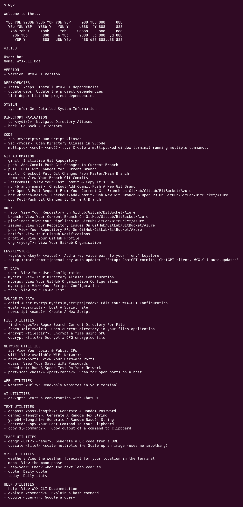

# ⚡️ WYX CLI ⚡️

Optimize your development productivity in the terminal

<hr>

<<<<<<< HEAD
[](https://hwixley.github.io/wyx-cli/) [](https://github.com/hwixley/WYX-CLI/actions/workflows/jekyll-gh-pages.yml) [](https://github.com/hwixley/WYX-CLI/actions/workflows/main.yml)<br>   
=======
[](https://hwixley.github.io/wyx-cli/) [](https://github.com/hwixley/WYX-CLI/actions/workflows/jekyll-gh-pages.yml) [](https://github.com/hwixley/WYX-CLI/actions/workflows/main.yml)<br>   
>>>>>>> 92daa08da407963c393833a8dd78871be1b2a4df

<hr>
<p align="center">

</p>

<hr>

## Table of Contents

- [⚡️ WYX CLI ⚡️](#️-wyx-cli-️)
  - [Table of Contents](#table-of-contents)
  - [What It Does](#what-it-does)
    - [Why It Was Made](#why-it-was-made)
  - [Support This Project](#support-this-project)
  - [Dependencies](#dependencies)
  - [Installation](#installation)
  - [Extra Feature Setup](#extra-feature-setup)
  - [Factory-reset Installation](#factory-reset-installation)
  - [List of Commands](#list-of-commands)
      - [Defaults](#defaults)
<<<<<<< HEAD
=======
  - [Bugs, New Features, \& Questions](#bugs-new-features--questions)
  - [Make A Contribution](#make-a-contribution)
>>>>>>> 92daa08da407963c393833a8dd78871be1b2a4df

<hr>

## What It Does

Provides developers with the ability for optimising the execution of commonly performed tasks, commands, directory navigations, and environment setups/script executions.

### Why It Was Made

I found myself executing the same commands repeatedly, finding navigation on the terminal for frequently accessed locations needlessly slow, and the task of pushing out new code via manually submitting a PR on my browser repetitive and time-wasting. I decided to start developing my own bash script to help alleviate these issues, and realized the whole world of opportunity I had to help optimize my own daily workflows on the terminal.

I knew I was not the only one who had suffered from these productivity issues as my co-workers saw interest in the tool I was developing. Upon this I decided to start developing a more generic and robust version of my original tool to allow developers across the world optimize their productivity with this tool too!

<hr>

## Support This Project

I am developing this project in my spare time to help developer's across the globe maximize their productivity in the terminal. If you have found this tool useful please leave a star on this repository it really helps me out! I also have a [buymeacoffee](https://www.buymeacoffee.com/hwixley) sponsor link if you would like to help me to continue to be able to develop OSS in spare time by helping me stay caffeinated and coding. :coffee: :zap:

<hr>

## Dependencies

<ins>The dependencies include:</ins>

- `openssl` for the [Random String Generation](https://github.com/hwixley/wyx-cli#text-utilities) commands.
- `git` for all [Git Automation](https://github.com/hwixley/wyx-cli#git-automation) commands.
- Visual Studio Code for the `vsc` code editor command.
- XCode for the `xc` code editor command (only available for Macintosh systems).
- `speedtest` (the Ookla speedtest-cli) for runnning network speed tests. The installation commands for this on MacOS and Debian are in `setup.sh`.

<hr>

## Installation

1. Clone this repository into a folder of your choice:

```
git clone git@github.com:hwixley/WYX-CLI.git
```

2. Navigate into the directory:

```
cd WYX-CLI
```

3. Give permissions to the setup script and run it:

```
chmod +x setup.sh && ./setup.sh
```

4. Reopen your terminal or run `source ~/.bashrc` (`source ~/.zshrc` for unix systems)

Type `wyx` to see the list of commands and start developing some magic!

## Extra Feature Setup

1. You can use OpenAI's ChatGPT to write commit messages for you (using `git diff` and `git status` outputs) when using the `wyx push` command. <i>This requires an OpenAI API key.</i>

```
wyx setup smart_commit
```

## Factory-reset Installation

1. Remove your installation

```
rm -rf <path-of-installation>
```

1. Remove the wyx-cli script setup in your environment file
   - Open the file in an editor: (`~/.bashrc` for linux systems, and `~/.zshrc` for unix systems)
     ```
     gedit ~/.bashrc
     ```
     If `gedit` is not available you can always use vim instead:
     ```
     vi ~/.bashrc
     ```
   - Remove the 2 lines for the wyx-cli:<br>
     - The first line is a comment: `# WYX-CLI`<br>
     - The second line is where the command is actually setup: `alias wyx="<path-of-installation>/wyx-cli.sh"`
2. Follow the [installation instructions](https://github.com/hwixley/wyx-cli#installation)

<hr>

## List of Commands

Please note any command with an argument in angle brackets below (ie. `<branch>`) denotes a dynamic variable which is given by the user. If the text inside these angle has a `?` character at the end (ie. `<branch?>`) this denotes that this argument is optional and if left empty will fallback to the default.

#### Defaults

- `<branch?>` : if left empty the current branch will be used
- `<org?>` : if left empty the default GitHub organisation set in `myorgs` will be used
- Any other optional arguments that you omit will be prompted upon execution

<br>

<i>**\*\*Note: all commands below should be preceded by the `wyx` command, this was ommitted for readability.\*\***</i>
<br>

<<<<<<< HEAD

=======
$@COMMANDS@$

<hr>

## Bugs, New Features, & Questions

Please post bug reports and new features in the issues section - there are custom templates you can use for each of these. And please post any questions you may have in the discussion section, I will reply to these as soon as I can! :)

<hr>

## Make A Contribution

Contributions are welcome! Pick up a ticket from the Issues section and link it in your PR, I will review it when I can!
>>>>>>> 92daa08da407963c393833a8dd78871be1b2a4df
